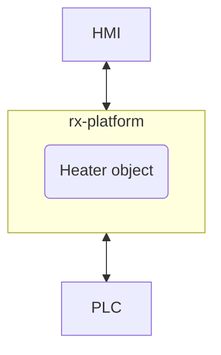

<div align="left">

</div>
<h1 align="left">
<b>{rx-platform}</b> .NET Core Configuration Reference
</h1>

___

.NET Core hosting for **```{rx-platform}```** enables development of platform applications using .NET Core runtime.
All the examples in this manual are given in C# language although other .NET Core languages can be used as well.

This manual describes the configuration options for **```{rx-platform}```** using .NET Core language constructs.
In the first chapter, we will cover the basic configuration options available for platform objects.
Afterwards, we will explore C# language constructs that enable
configuration of platform variables using C# classes as templates.

___


<h2 align="left">
{rx-platform} Variable Types
</h2>
<div style:"word-wrap: break-word;">

Inheritance inside the platform enables overriding every `value` or `constant` item inside any runtime object.
Overriding those items can be done by variable type.

Variable types are construct inside the platform configuration 
that define specific protocol or any algorithmic behavior for runtime points.

This allows you to adapt for different protocols and to provide various filtering and simulation behaviors.

Variable types provide additional mapping for your type properties.
They allow you to define how the properties of your objects are represented and accessed at runtime.
This can be achieved by declaring
C# classes decorated with appropriate attributes.

Variable Type is a runtime entity that has, besides of common runtime properties,
has additional items that define its behavior.
Those items are:
- `source` - defines a source of variable data
- `mapper` - define a mapping to a specific protocol or algorithm
- `filter` - define value transformation functions applied in variable read/write operations

Filters are items that provide input/output functions for variable read/write operations.
They are processed in the order of declaration and based on their declared direction (input/output/both).

Sources are items that provide data source for variable read/write operations.

Mappers are items that provide mapping to specific protocol or algorithm and provide read/write operations for the variable.

Distinction between those is in the state of variable. Only source has the state of the variable, mappers only act as a provider for variable access.
So any variable must have a source defined, while mappers are optional.

For example, a variable can have a register source and a Modbus Holding Register mapper defined.
Every write operation to the variable will write the value to the register source,
and every read operation will read the value from the register source.
Holding Register mapper will be acting as a Modbus Slave and every Modbus Master read/write operation will be mapped to the variable source, register variable in this case.
If register source is replaced for example with OPCUA Source then the variable will be reading/writing data from/to OPCUA server instead of local register.
So every Modbus Slave read/write operation will be mapped to OPCUA server instead of local register.

Variable types itself can provide additional properties that are specific to the multiple sources inside variable.
For example you can use _"Bridge Variable"_ as base class for your variable type to support data bridging between two protocols.

Base variable types provided by **```{rx-platform}```** are:
- _VariableBase_ - base class for all variable types, abstract type
  - _SimpleVariable_ - variable type that selects first available good source 
  - _ComplexInputVariable_ - variable type that supports multiple input sources selection types (first good, highest, lowest...)
  - _ComplexIOVariable_ - variable type that supports both input and output sources with multiple selection types
  - _BridgeVariable_ - variable type that supports data bridging between input and output sources.
  - _MultiplexerVariable_ - variable type enables multiplexing reads and de-multiplexing writes throughout sources based on the control signal.

Inside a platform there is not a single variable type besides base types above.


</div>

<h2 align="left">
{rx-platform} Port Types
</h2>
<div style:"word-wrap: break-word;">

Besides object types inside the platform, there are also port types, that provide connectivity to external systems.
Ports inside a platform are connected to a stack of different port types to create a protocol endpoint.

Base port types inside a platform are:
- _PortBase_ - base class for all port types, abstract type
  - _ExternalPort_ - external ports that sets at the bottom of the protocol stack
  - _TransportPort_ - transport ports that sets in the middle of the protocol stack
  - _RoutedTransportPort_ - routed transport ports that are in the middle of the stack and provide packet routing capabilities
  - _ConnectionTransportPort_ - connection transport ports that are in the middle of the stack and provide connection based routing capabilities
  - _ApplicationPort_ - application ports that sets at the top of the protocol stack

In order to create a protocol endpoint, you need to stack multiple port types together.
This requires knowledge of the protocol stack itself
(address format, different layers...) and how to configure each port type inside platform itself.

Defining the protocol stack can be done by engineers inside the platform 
or from the C# code itself.
Some protocol stacks can be created by using predefined utility functions for specific protocols.
Inside main nuget package of **```{rx-platform}```** 
there are two utility functions that create common protocol stacks:
- OPCUA Client/Server stack
- MQTT Client stack

In order to use some other protocol stacks, you need to have plugin inside a platform installed, and NuGet reference to a definition of this plugin.
Inside the platform default installation there is a Modbus plugin, that provides Modbus TCP/RTU protocol stacks, preinstalled.
So in order to create Modbus protocol stack you just have to reference NuGet package of Modbus plugin `ENSACO.RxPlatform.Modbus`.
After that you can create Modbus protocol stack by using predefined utility functions for Modbus protocol:
```csharp

var stack = ModbusUtility.CreateModbusTcpSlaves(502, new byte[] { 1, 2, 3 });
            stack.TcpPort.Timeouts.ReceiveTimeout = 60000;
            
await ModbusUtility.DownloadStack(stack, "Test1", "ports", Assembly.GetExecutingAssembly());


```

this will create Modbus TCP Slave protocol stack with 3 slave addresses (1, 2, 3) listening on port 502.

In the platform several port types are created and from stack bottom to top are:
- _Test1TcpServerPort_ - external TCP Server port that listens on port 502
    - _Test1ModbusTcpPort_ - transport port that handles Modbus TCP transport protocol
      - _Test1RouterPort_ - routed transport port that routes Modbus packets based on slave address
        - _Test1ModbusSlave_1_ - application Modbus Slave port for slave address 1
        - _Test1ModbusSlave_2_ - application Modbus Slave port for slave address 2
        - _Test1ModbusSlave_3_ - application Modbus Slave port for slave address 3

In order to use protocol stack inside your objects, you need to reference the top port of the stack inside your object configuration.
this can be done by creating property of top port type and mark it with `PortReference` attribute and connect it to the top port of the stack.
This is shown in the example below and will be explained in detail later in this manual:
```csharp
class SomeModbusUserObject
{

    [PortReference()]
    public ModbusSlaveConnection ModbusSlave { get; set; }

}

// inside some async method
var stack = ModbusUtility.CreateModbusTcpSlaves(502, new byte[] { 1, 2, 3 });
            stack.TcpPort.Timeouts.ReceiveTimeout = 60000;
await ModbusUtility.DownloadStack(stack, "Test1", "ports", Assembly.GetExecutingAssembly());
await RxPlatformRuntimeBase.CreateObject(new SomeModbusUserObject()
    {
        ModbusSlave = stack.Slaves[1] // connect to Modbus Slave with address 2

    }, "myObject");
```


</div>

<h2 align="left">
C# classes as {rx-platform} Configuration Templates
</h2>
<div style:"word-wrap: break-word;">


Inside **```{rx-platform}```** .NET Core hosting, C# classes can be used as configuration templates for platform objects.
This enables yo to define runtime types that can not be created as a dotnet runtime. These are Variable, Filter, Domain, Application and Port Types.

Using template mechanism you can also extend your runtime object or struct type in order to provide variable implementation for your custom types.
This is done by creating C# classes with appropriate attributes.

In order to show how these templates work we will use the example from the [code reference](RxPlatformDotNetCodeManual.md) 
where we had `Heater` object type and `Sensors` struct type witch we will extend to read data from some Modbus field device.

Types that are decorated with
```RxPlatformDeclare``` attribute are parsed as platform template types.
Reflection parsing of C# type as platform configuration template is similar as parsing of runtime dotnet types.

Every property inside C# class or struct is parsed as platform `constant`, `value`, `struct` or `relation` item.
Also in template parsing there are other types of entities that can be created:
- Variable Types
- Source Types
- Mapper Types
- Filter Types

In the next section we will cover rules for creating those entities inside C# classes.


<h4 align="left">
Constant Items
</h4>

```constant```
items are mapped from properties that have the following characteristics:
  - non-virtual
  - non-static 
  - property type is plain type
  - property type is complex data type
  - property has only get accessor
  - property has both get and init accessor

<h4 align="left">
Value Items
</h4>

```value```
items are mapped from properties that have the following characteristics:
  - non-virtual
  - non-static 
  - property type is plain type
  - property type is complex data type
  - property has both get and set accessor


<h4 align="left">
Struct Items
</h4>

```struct```
items are mapped from properties that have the following characteristics:
  - non-virtual
  - non-static
  - property type is of class decorated with
    ```RxPlatformStructType```
  - property has only get accessor
  - property has both get and init accessor

 Note that in template parsing, struct items does not need to have type decorated with either ```RxPlatformRuntime``` or ```RxPlatformDeclare``` attribute,

<h4 align="left">
Variable Items
</h4>

```variable```
items are mapped from properties that have the following characteristics:
  - non-virtual
  - non-static
  - property type is of ```VarT<T>``` where ```VarT``` is generic decorated with
    ```RxPlatformVariableType``` and ```T``` is plain type or complex type
  - property has only get accessor
  - property has both get and set/init accessor

 Although properties of type ```VarT<T>``` are used for template only it is important to define property accessor correctly.
 Declaring it with only get or get and init accessor will create read-only variable and declaring it with get and set accessor will create read-write variable.

 This is show bellow on the example of `Sensors` struct type that we will extend to have Modbus variables for temperature and humidity:
 ```csharp
[RxPlatformStructType(nodeId: "5F7B75D9-6E4C-4A89-87A6-4CA29DED467E")]
[RxPlatformDeclare()]
public class SensorsExtended : Sensors
{
    public new ModbusHRVariable<double> Temperature { get; } = new ModbusHRVariable<double>()
    {
        Address = 20
    };
    public new ModbusHRVariable<double> Humidity { get; } = new ModbusHRVariable<double>()
    {
        Address = 21
    };

}
```
Notice the `new` keyword used in property declaration this is because we are extending existing `Sensors`
struct type and overriding a existing properties.


<h4 align="left">
Relation Items
</h4>

```relation```
items are mapped from properties that have the following characteristics:
  - non-virtual
  - non-static
  - property is decorated with ```RxPlatformRelation``` or derived attribute.
  - property type is of class decorated with
    ```RxPlatformObjectType```, ```RxPlatformDomainType```, ```RxPlatformApplicationType``` or ```RxPlatformPortType```
  - property type is null-able
  - property has only get accessor
  - property has both get and set/init accessor

Like for variable types property accessor must be defined correctly in order to create static or dynamic relations.
Defining a relation item is shown on the example bellow:
```csharp
[RxPlatformObjectType(nodeId: "E4DC3866-2EA8-436D-A77B-A0258E22D580")]
[RxPlatformDeclare()]
class HeaterExtended : Heater
{    
    [PortReference()]
    public ModbusMasterConnection? Modbus { get; set; }
}
```
This will create a relation item `ModbusMaster` inside `HeaterExtended` object type that references a Modbus master port.


<h4 align="left">
Source Items
</h4>

```source```
items are mapped from properties that have the following characteristics:
  - non-virtual
  - non-static
  - property type is of class decorated with
    ```RxPlatformSourceType```
  - property has only get accessor
  - property has both get and init/set accessor

Define property accessor for the source to determine I/O capabilities.
Declaring it with only get or get and init accessor will create input only source
and declaring it with get and set accessor will create input/output source.


<h4 align="left">
Mapper Items
</h4>

```mapper```
items are mapped from properties that have the following characteristics:
  - non-virtual
  - non-static
  - property type is of class decorated with
    ```RxPlatformMapperType```
  - property has only get accessor
  - property has both get and init/set accessor

Define property accessor for the mapper to determine read/write capabilities.
Declaring it with only get or get and init accessor will create read only mapper
and declaring it with get and set accessor will create read/write mapper.


<h4 align="left">
Filter Items
</h4>

```filter```
items are mapped from properties that have the following characteristics:
  - non-virtual
  - non-static
  - property type is of class decorated with
    ```RxPlatformFilterType```
  - property has only get accessor
  - property has both get and init/set accessor

Define property accessor for the filter to determine I/O capabilities.
Declaring it with only get or get and init accessor will create input filter
and declaring it with get and set accessor will create input/output filter.

</div>


</div>

<h2 align="left">
Creating Variable Types
</h2>
<div style:"word-wrap: break-word;">

Variable types can be created by defining C# classes decorated with
```RxPlatformVariableType``` and ```RxPlatformDeclare``` attributes.
Inside variable declaration you can define source, mapper and filter items for the variable.
Example bellow shows how to create Modbus Holding Register variable type
with OPCUA mapping and linear scaling filter:
```csharp
[RxPlatformVariableType(nodeId: "0A7C96E9-EC2B-4A73-8C05-A3FE4A0498EC")]
[RxPlatformDeclare()]
class ModbusHRVariable<T> : SimpleVariable<T>
{
    // this variable is accesible through OPCUA protocol
    public OpcSimpleMapper OPC { get; set; } = new OpcSimpleMapper();
    
    // this variable's state is on the remote Modbus Slave device
    public ModbusHoldingRegisterSource HR { get; set; } = new ModbusHoldingRegisterSource();

    // use scaling filter for value transformation
    public LinearScaling Scaling { get; set; } = new LinearScaling
        {
            HiEU = 100,
            LowEU = 0,
            HiRaw = 1000,
            LowRaw = 0
        };
}
````
This way you can create multiple variable types for different protocols and behaviors of your platform application.


<h2 align="left">
Extending Runtime Object Types
</h2>
<div style:"word-wrap: break-word;">


Using our example of ```Heater``` object type we can create extended
object type that uses proper variables to fulfill the flowing scenario:

In this scenario SCADA system is connected to the platform using OPCUA protocol and PLC is connected using Modbus protocol.
PLC values that represent temperature and humidity sensor readings are stored in Holding Registers 20 and 21.
Set point is stored in Holding Register 10 in PLC.
These values are presented as integer scaled by factor of 10 (for example temperature 25.6C is stored as 256).
PLC start command for heater is stored in Coil 5.

Looking at the definition of `Heater` object type from [code reference](RxPlatformDotNetCodeManual.md) we can create extended object type `HeaterExtended`
that uses proper variable and struct types for this scenario.

Looking at the `Heater` object type definition we can see that it has set point, default set point and start properties.
Object also has `Sensors` struct type for temperature and humidity variables that need to be accessible from SCADA system.
We can determine that there are three types of variables needed:
- variable that has OPCUA mapping and Modbus Holding Register source with scaling for PLC access
- variable that has OPCUA mapping and Modbus Coil source for PLC access.
- variable that has OPCUA mapping and Register source for local settings

So we declare three variable types:
```csharp
[RxPlatformVariableType(nodeId: "0A7C96E9-EC2B-4A73-8C05-A3FE4A0498EC")]
[RxPlatformDeclare()]
class ModbusHRVariable<T> : SimpleVariable<T>
{
    // this variable is accesible through OPCUA protocol
    public OpcSimpleMapper OPC { get; set; } = new OpcSimpleMapper
        {
            Port = "OPC"
        };
    
    // this variable's state is on the remote Modbus Slave device
    public ModbusHoldingRegisterSource HR { get; set; } = new ModbusHoldingRegisterSource();

    // use scaling filter for value transformation
    public LinearScaling Scaling { get; set; } = new LinearScaling
        {
            HiEU = 100,
            LowEU = 0,
            HiRaw = 1000,
            LowRaw = 0
        };
}

[RxPlatformVariableType(nodeId: "B0C84DF9-C6BA-4992-A2A1-AC853FBB0DE3")]
[RxPlatformDeclare()]
class ModbusCoilVariable<T> : SimpleVariable<T>
{
    // this variable is accesible through OPCUA protocol
    public OpcSimpleMapper OPC { get; set; } = new OpcSimpleMapper();
    
    // this variable's state is on the remote Modbus Slave device
    public ModbusCoilSource HR { get; set; } = new ModbusCoilSource();

}

[RxPlatformVariableType(nodeId: "0EEB82AA-517E-4D05-8CEA-74FEB2753B1D")]
[RxPlatformDeclare()]
class LocalVariable<T> : SimpleVariable<T>
{
    // this variable is accesible through OPCUA protocol
    public OpcSimpleMapper OPC { get; set; } = new OpcSimpleMapper();
    
    // this variable's state is on the remote Modbus Slave device
    public RegisterSource HR { get; set; } = new RegisterSource();

}
```
After defining variable types we can create extended struct type `SensorsExtended` 
that uses `ModbusHRVariable<double>` for temperature and humidity variables:
```csharp
[RxPlatformStructType(nodeId: "0EEB82AA-517E-4D05-8CEA-74FEB2753B1D")]
[RxPlatformDeclare()]
struct SensorsExtended : Sensors
{
    public ModbusHRVariable<double> Temperature { get; set; } = new ModbusHRVariable<double>
        {
            HR = new ModbusHoldingRegisterSource
            {
                Port = "Modbus",
                Address = 20
            }
        };
    public ModbusHRVariable<double> Humidity { get; set; } = new ModbusHRVariable<double>
        {
            HR = new ModbusHoldingRegisterSource
            {
                Port = "Modbus",
                Address = 21
            }
        };
}
```
Finally we can create extended object type `HeaterExtended` that uses `ModbusHRVariable<double>` for set point, 
`LocalVariable<double>` for default set point variable and `ModbusCoilVariable<bool>` for start variable:
```csharp
[RxPlatformObjectType(nodeId: "0EEB82AA-517E-4D05-8CEA-74FEB2753B1D")]
[RxPlatformDeclare()]
class HeaterExtended : Heater
{
    public new ModbusHRVariable<double> SetPoint { get; set; } = new ModbusHRVariable<double>
        {
            HR = new ModbusHoldingRegisterSource
            {
                Port = "Modbus",
                Address = 10
            }
        };
    public new LocalVariable<double> DefaultSetPoint { get; set; } = new LocalVariable<double>();
    public new ModbusCoilVariable<bool> Start { get; set; } = new ModbusCoilVariable<bool>
        {
            HR = new ModbusCoilSource()
            {
                Port = "Modbus",
                Address = 5
            }
        };

    public new SensorsExtended Sensors { get; } = new SensorsExtended();
    
    [PortReference()]
    public ModbusMasterConnection? Modbus { get; set; }
    
    [PortReference()]
    public OpcServerBase? OPC { get; set; }
}
```
Notice that al sources and properties we used have `Port` property defined.
That is true for almost all source and mapper types inside the platform.

This property contains relation name and is used to connect source/mapper to proper protocol stack
inside the platform through `PortReference` relation defined in the object.

After defining extended object type we can create instance of it inside the platform runtime:
```csharp
// communication parameters
string plcIp = "192.168.1.117";
ushort plcPort = 502;
ushort opcPort = 4840;
string opcAppName = "HeaterOP";

// create Modbus protocol stack
var modbusStack = ModbusUtility.CreateModbusTcpMasters(plcIp, plcPort, new byte[] { 1 });
await ModbusUtility.DownloadStack(
    modbusStack, "Modbus", "ports", Assembly.GetExecutingAssembly());

// create OPCUA protocol stack
var opcStack = OpcUtility.CreateOpcUaServerStack(opcPort, opcAppName);
await OpcUtility.DownloadStack(
    opcStack, "OPC", "ports", Assembly.GetExecutingAssembly());

// create HeaterExtended object for template
var heaterTemp = new HeaterExtended()
{
    Modbus = modbusStack.Masters[0], // connect to Modbus Master
    OPC = opcStack.OpcServer, // connect to OPCUA Server
    Options = new HeaterOptions 
        {
            Id = 10001,
            Name = "HeaterXZ01"
        }
};
// create instance inside platform using template
var heater = await RxPlatformRuntimeBase.CreateInstance<Heater>(heaterTemp, "Heater0011");
// assign a pump previously created
heater.WaterPump = myPumps["PumpA1"];
// do diagnostics
await heater.PerformDiagnostics();
// register it inside our collection
myHeaters.Add(heater.Options.Name, heater);
```

This will create instance of `HeaterExtended` object type inside the platform runtime
but platform will create it as `Heater` object type witch is defined as runtime type inside your C# code.
Now from within the object you can access all properties and methods defined in `Heater` object type and 
all variables will have proper sources and mappers defined for PLC and SCADA access.

</div>

